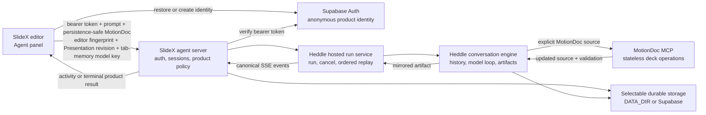

# SlideX conversational agent: architecture and operations

This is the stable starting point for maintainers and coding agents working on
the SlideX conversational editing experience. It describes the current product
contract, ownership boundaries, runtime path, deployment requirements, and the
next durable-session slice.

The live code and tests are authoritative when this document and an
implementation detail disagree. Keep component-specific detail near the code:

- [`src/server/agent/README.md`](../src/server/agent/README.md) owns the server
  agent boundary.
- [`src/server/http/README.md`](../src/server/http/README.md) owns inbound HTTP
  policy.
- [`src/server/lifecycle/README.md`](../src/server/lifecycle/README.md) owns
  process drain and shutdown.
- [`src/server/observability/README.md`](../src/server/observability/README.md)
  owns logging and redaction.
- `features/pitch/README.md` in the companion SlideX editor repository owns the
  editor-side boundary.
- `packages/slidex-mcp-server/README.md` in the editor repository owns the
  MotionDoc MCP tool surface.

## Product contract

The conversational agent can create a deck, revise it over multiple turns,
show activity, restore product history after refresh, recover a retained active
run, and apply an accepted MotionDoc through the editor's undo-aware path.

The feature is opt-in and default-off in both repositories. The editor only
shows the agent when it was built with
`NEXT_PUBLIC_SLIDEX_AGENT_ENABLED=true`; the server only registers the
reconnectable routes when it starts with `SLIDEX_AGENT_ENABLED=true`.

Completed product history and Heddle conversation state can use either file
storage under `DATA_DIR` or independent server-only Supabase adapters. Configure
both adapters for completed-conversation continuity across replicas. Active-run
coordination and event replay remain process-local, so losing an in-flight run
when its process disappears is an accepted MVP behavior.

## System map



### One turn end to end

1. The editor obtains a Supabase access token for product identity. This token
   is separate from the user's model credential.
2. The editor starts a run with a persistence-safe copy of the current
   MotionDoc, its editor-source fingerprint, the numeric canonical Presentation
   revision, the prompt, and the OpenAI key held in current-tab React memory.
3. The server authenticates the user, resolves or creates the user's product
   session, persists the accepted user message, and starts a Heddle run.
4. Heddle reuses the durable conversation for that product session, owns the
   model/tool loop, and invokes the stateless MotionDoc MCP with an explicit
   source.
5. MotionDoc-writing tools return the next source. Heddle mirrors those results
   into artifacts and makes the newest accepted source current.
6. The SlideX server projects the generic turn into a product result. A changed
   deck is accepted only when the exact final source passed MotionDoc
   validation. The visible assistant summary is source-free and bounded.
7. In Supabase product mode, the server commits a changed final source through
   the user-scoped Presentation CAS. A read-only result skips the write. A newer
   manual edit produces a recoverable conflict; only an equivalent intervening
   autosave may be retried once.
8. The server persists the safe user-facing terminal transcript after the deck
   commit. File product mode instead persists the terminal and MotionDoc as an
   explicit durable pending result.
9. Heddle publishes ordered activity and one terminal over SSE. Heddle Remote
   owns cursor, duplicate, gap, retry, and terminal-consumption policy in the
   browser.
10. The editor applies a non-stale result through its existing `commitSource`
   path. If the user edited the deck after run start, the result stays pending
   instead of silently overwriting the newer source. In Supabase mode, its
   existing save coordinator acknowledges the already committed remote source.
   Heddle persists model-facing conversation history and artifacts separately.

## Ownership boundaries

| Owner | Owns | Must not own |
|---|---|---|
| Heddle conversational core | Model/tool loop, model-facing history, leases, compaction, activities, artifacts, MCP host extensions, typed model failures | SlideX prompts, MotionDoc product policy, auth, HTTP routes |
| Heddle hosted layer | Run IDs, one-active-run coordination, cancellation, ordered events, bounded replay, terminal publication | Product tenancy, product persistence, public error wording |
| Heddle HTTP/SSE kit | Replay cursor parsing, SSE framing, backpressure, disconnect cleanup | Route registration, auth, CORS, deployment policy |
| Heddle Remote | Browser-safe protocol validation, run transport, cursor/gap/duplicate policy, bounded reconnect | Product identity, model credentials, React state, deck application |
| SlideX agent server | Auth and tenancy, product sessions, SlideX prompt/approval policy, MotionDoc finalization, safe product errors, CORS, logging, lifecycle | Reimplementing Heddle's run registry, SSE protocol, or conversation history |
| SlideX editor | Agent UI, anonymous product identity, tab project/session binding, ephemeral BYOK, history, reconnect UX, undo/manual-edit protection | Runtime policy, server persistence, custom SSE parsing |
| MotionDoc MCP | Stateless parsing, creation, editing, validation, and export over an explicit source | Product sessions, credentials, run state, conversational memory |

Do not replay the SlideX chat projection into model prompts. Heddle is the
source of truth for model conversation continuity; the SlideX session is the
user-facing product projection.

## Identity, state, and secrets

| Concern | Identity or storage | Lifetime and notes |
|---|---|---|
| Product user | Supabase user ID from a bearer token | Anonymous auth is the MVP identity. The Supabase browser session may survive refresh. |
| Editor project | Stable project instance ID in `sessionStorage` | Tab-scoped; independent of mutable project names; new/imported decks rotate it. |
| Product conversation | SlideX `sessionId` | File JSON under `DATA_DIR/sessions/<user>/` or Supabase `agent_sessions` plus `agent_session_messages`; contains the browser-safe transcript and Presentation association. |
| Model conversation | Deterministic Heddle session | File state under `DATA_DIR/heddle/` or Supabase `agent_session_records` plus the archive tables; contains model-facing history, compacted transcripts, rolling summaries, and one durable conversation per SlideX product session. |
| Active run and replay | In-process `ConversationRunService` | One active run per user/session; up to 512 events retained for five minutes. Lost on process restart. |
| Model credential | Agent-panel React state and the live run-start request | Forgotten on refresh or **Forget key**. Never persisted, logged, traced, emitted, or placed in URLs/cookies/analytics. |
| Current deck | Editor source, request MotionDoc, canonical `presentations.source`, and accepted Heddle artifact | The request source is authoritative at run start because the user may edit manually between turns; Supabase product-history hydration reads the canonical Presentation rather than duplicating deck source in message rows. |

Supabase owns identity and can own completed deck, product-transcript, and
Heddle-runtime persistence. It does not own active runs, live SSE subscribers,
or short replay in this MVP.

## Public interfaces

All agent and session operations require the Supabase bearer token. CORS is not
authentication.

### Reconnectable run API used by the editor

- `POST /api/agent/runs` accepts a run and returns `202` with `runId`,
  `acceptedAt`, and the accepted product session.
- `GET /api/agent/runs/:runId/events` streams or replays canonical Heddle
  events. Resume with `?after=<sequence>` or `Last-Event-ID`.
- `POST /api/agent/runs/:runId/cancel` requests cancellation.
- `GET /api/agent/sessions/:sessionId` hydrates the authorized product session
  and reports a process-local active run when one is retained.
- `DELETE /api/agent/sessions/:sessionId` cancels an active run and deletes the
  product session. The current editor deck is not deleted.

Run-start body:

```json
{
  "sessionId": "optional-existing-session-id",
  "title": "Optional display title",
  "presentationId": "canonical-presentation-id",
  "presentationTitle": "Current deck title",
  "message": "Make the opening slide more visual",
  "motionDoc": "<current MotionDoc source>",
  "sourceRevision": "stable-editor-source-revision",
  "presentationSourceRevision": 7,
  "llmApiKey": "<user-provided key>",
  "model": "optional-model-name"
}
```

Failures use a stable JSON envelope:

```json
{
  "error": {
    "code": "active_run_conflict",
    "message": "An agent run is already in progress for this conversation"
  }
}
```

Request-level codes are `auth_required`, `invalid_request`,
`session_not_found`, `run_not_found`, `active_run_conflict`,
`replay_unavailable`, and `internal_error`. Model credential, quota,
validation, Presentation conflict/finalization, completion-record, and run
failures are sanitized terminal events rather than raw provider errors. An
exact terminal whose append response was lost is recovered by run identity;
an ambiguous post-save failure tells the client to refresh before retrying.

The existing `POST /api/agent/stream` and tRPC session procedures predate the
editor's reconnectable lifecycle. Maintain compatibility, but put new editor
run behavior on the reconnectable API rather than extending another lifecycle.

### Health and observability

`GET /healthz` is the platform healthcheck. It proves the HTTP process started
and reports basic configuration; it does not execute a model call or fully
preflight the external MotionDoc MCP. Treat it as liveness/startup evidence,
not an end-to-end readiness check.

Every HTTP response has `X-Request-ID`. Accepted and terminal run logs use
`runId` as the support correlation key. Logs may include IDs, model, outcome,
duration, and tool-call count, but not prompts, MotionDoc source, user identity,
headers, cookies, provider bodies, or `llmApiKey`.

## Security invariants

- Use HTTPS for every deployed editor-to-server request; the model key exists
  in the start-request body while that request is processed.
- Never add the model key to environment variables, browser persistence,
  product sessions, Heddle state, events, artifacts, logs, or error text.
- Keep product identity and model credentials separate. A model key is not a
  login or tenant identifier.
- Production ignores `DEV_AUTH_BYPASS` and `DEV_HEDDLE_AUTH_STORE`. Do not
  depend on either shortcut outside local diagnostics.
- When the production agent is enabled, `CORS_ORIGIN` must be an explicit,
  comma-separated HTTP(S) origin allowlist. Missing values and `*` fail startup.
- Browser requests use bearer headers, not cookies; CORS credentials remain
  disabled.
- Preserve sanitized stable terminal codes. Never expose raw provider messages
  or full MotionDoc source as assistant text.
- Treat `DATA_DIR` as sensitive application data. Restrict volume access and
  back it up according to the product's retention policy.

## Local development

### Deterministic server profile

The checked-in `.env.example` runs the mock engine, reconnectable lifecycle,
JSON persistence, SSE, cancellation, and development auth bypass without an LLM
or MotionDoc MCP:

```bash
npm ci
cp .env.example .env
npm test
npm run dev:server
```

This profile is best for server/API work. The real editor still needs its
Supabase public variables because the editor owns product identity acquisition,
even when the server itself accepts the development bypass.

### Product-faithful profile

Use the official local Supabase stack or a configured Supabase project with
anonymous sign-in enabled. The root README contains the complete setup. A
typical local allocation is server `3180` and editor `3181`:

```bash
# Server .env
NODE_ENV=development
PORT=3180
DATA_DIR=.local/data
CORS_ORIGIN=http://127.0.0.1:3181,http://localhost:3181
AGENT_DRIVER=heddle
SLIDEX_AGENT_ENABLED=true
SUPABASE_URL=http://127.0.0.1:54321
SUPABASE_ANON_KEY=<local-anon-key>
HEDDLE_WORKSPACE_ROOT=/absolute/path/to/SlideX
MOTIONDOC_MCP_COMMAND=npm
MOTIONDOC_MCP_ARGS='["run","mcp"]'
MOTIONDOC_MCP_CWD=/absolute/path/to/SlideX
```

```bash
# Editor .env.local; values are inlined at build/start time
NEXT_PUBLIC_SLIDEX_AGENT_ENABLED=true
NEXT_PUBLIC_SLIDEX_AGENT_SERVER_URL=http://127.0.0.1:3180
NEXT_PUBLIC_SUPABASE_URL=http://127.0.0.1:54321
NEXT_PUBLIC_SUPABASE_ANON_KEY=<same-local-anon-key>
```

```bash
# Server repository
npm run dev:server

# SlideX editor repository
npm run dev -- --port 3181
```

The `3180`/`3181` pair is only a collision-free convention. Any ports work when
the editor URL, server URL, Supabase site URL, and CORS allowlist agree.

Open `/workspace/pitch/`, enter a funded OpenAI API key in Agent settings, and
exercise the manual acceptance flow below. The server also provides
`npm run try:anonymous-byok` and `npm run try:anonymous-byok -- --quality` for
repeatable API-level evidence; those commands complement, but do not replace,
real product interaction.

## Deployment contract

### Editor

SlideX is a Next.js static export. Set these values before building:

```bash
NEXT_PUBLIC_SLIDEX_AGENT_ENABLED=true
NEXT_PUBLIC_SLIDEX_AGENT_SERVER_URL=https://agent.example.com
NEXT_PUBLIC_SUPABASE_URL=https://<project>.supabase.co
NEXT_PUBLIC_SUPABASE_ANON_KEY=<public-anon-key>
```

`NEXT_PUBLIC_*` values are embedded in the client bundle. Changing a flag,
origin, or Supabase project requires rebuilding and redeploying the editor.
There is deliberately no editor model-key environment variable.

### Server

Run a long-lived Node.js 20 process with at least:

```bash
NODE_ENV=production
PORT=3000
SLIDEX_AGENT_ENABLED=true
AGENT_DRIVER=heddle
DATA_DIR=/data
CORS_ORIGIN=https://editor.example.com
SUPABASE_URL=https://<project>.supabase.co
SUPABASE_ANON_KEY=<server-configured-anon-key>
SUPABASE_SERVICE_ROLE_KEY=<server-only-service-role-key>
SLIDEX_PRODUCT_SESSION_STORAGE=supabase
HEDDLE_SESSION_STORAGE=supabase
DEFAULT_MODEL=<tested-model>
HEDDLE_WORKSPACE_ROOT=/app
MOTIONDOC_MCP_COMMAND=<installed-command>
MOTIONDOC_MCP_ARGS=<JSON-array-of-arguments>
MOTIONDOC_MCP_CWD=/app
LOG_LEVEL=info
SHUTDOWN_GRACE_MS=30000
```

With both storage selectors set to `supabase`, completed browser-visible chat,
completed model-facing history, and the canonical Presentation source survive
process replacement and can be hydrated by any replica. `DATA_DIR` is still
required for file mode and may also contain runtime artifacts, traces, and the
MotionDoc MCP workspace. Mount a persistent volume whenever those files must
survive a deploy.

Active-run ownership, SSE replay, and cancellation remain process-local.
Multiple replicas therefore support completed-conversation continuity, but an
in-flight run needs routing affinity so start, subscribe, and cancel reach the
owning process. Losing an in-flight stream during a restart is accepted; the
last completed transcript and model conversation remain durable.

The reverse proxy must support long-lived SSE: disable response buffering,
avoid transforming event frames, forward `Last-Event-ID`, and set idle/request
timeouts above the longest supported agent turn. A rolling deploy should allow
at least `SHUTDOWN_GRACE_MS` for drain. Restarting a process ends active replay
even though completed conversation history remains in the selected durable
repositories.

### MotionDoc MCP packaging gap

The current server `Dockerfile` builds this repository only. The real Heddle
driver executes the MotionDoc MCP owned by the SlideX editor repository, so the
image is not yet a self-contained real-agent deployment.

Before enabling a production deployment:

1. choose and pin the exact tested MotionDoc MCP artifact or package version,
   plus any workspace skills required for production behavior;
2. install or copy its compiled output into the server image at build time;
3. configure `MOTIONDOC_MCP_COMMAND`, `MOTIONDOC_MCP_ARGS`, and
   `MOTIONDOC_MCP_CWD` to that immutable local artifact;
4. smoke-test MCP catalog preparation and one validated deck mutation inside
   the final image; and
5. replace both Docker-stage `npm install` commands with deterministic
   `npm ci` installs using the committed lockfile.

Do not use an unpinned runtime `npx -y` download as the production packaging
strategy. Until the image includes the tested MCP artifact, Railway metadata is
useful deployment scaffolding, not a turnkey real-agent release.

## Verification and acceptance

### Repository checks

Server:

```bash
npm ci
npm test
npm run typecheck
npm run build
git diff --check
```

Editor:

```bash
npm ci
npm run test:agent
npx tsc --noEmit
npm run mcp:build
npm run lint
npm run test:agent:e2e
npm run build
git diff --check
```

Also build the editor once with the agent flag enabled. The default build proves
the upstream-compatible experience; the enabled build proves the integration
is actually bundled.

### Hands-on product acceptance

For this project, an end-to-end product check means human-style interaction
with the real running editor, server, Heddle engine, and MotionDoc MCP. Automated
tests and API harnesses are regression evidence, not a substitute.

At minimum:

1. Create a deck from a specific multi-slide brief and compare the visible
   artifact with the request.
2. Make a constrained second-turn edit and verify unrelated slides stay stable.
3. Use a later prompt that depends on remembered conversation context.
4. Refresh and verify deck/history/project continuity while the model key is
   forgotten.
5. Re-enter the key and ask a read-only question; the MotionDoc must not change.
6. Verify cancellation, a rejected key, a quota-exhausted key, and a stale
   manual-edit result all produce honest recoverable states.
7. Confirm the exact model key has no matches in browser/server persistence,
   public events/results, Heddle state, or logs.
8. Force one Heddle compaction, replace the server process, and verify a fresh
   repository/engine loads the manifest and rolling summary before continuing
   the conversation.

Record requested versus actual artifact changes, latency, tool activity,
validation result, and pass/fail for each turn.

## Troubleshooting

| Symptom | First checks |
|---|---|
| Agent button is missing | Confirm both feature flags; rebuild the editor after changing `NEXT_PUBLIC_*`. |
| `Failed to fetch` | Confirm the server is listening on the URL embedded in the editor, the browser origin is in `CORS_ORIGIN`, and HTTPS pages are not calling an HTTP API. |
| Stuck on **Working** or **Thinking** | Inspect the run by `runId`, server terminal logs, SSE proxy buffering/timeouts, provider credential/quota state, and MCP subprocess output. |
| Key is empty after refresh | Expected: BYOK is current-tab memory only. Re-enter it. |
| Conversation or deck disappears after deploy | Confirm both Supabase selectors are enabled, the service-role credential can access `agent_sessions`, `agent_session_messages`, `agent_session_records`, both archive tables, and both append RPCs, and the canonical `presentations.source` was saved. In file mode, confirm a persistent `DATA_DIR` volume is mounted. |
| `replay_unavailable` | The in-process replay window expired or the process restarted. Hydrate durable session history; do not invent missing progress. |
| MCP preparation fails | Verify the configured command, arguments, working directory, installed artifact, Node version, and filesystem permissions inside the service environment. |
| Completed result does not overwrite the deck | Check validation and source-revision conflict state. A failed validation or manual edit intentionally prevents silent replacement. |

## Session list and switcher

The first durable-work slice uses this model:

- the authenticated user owns a newest-first list of SlideX product sessions;
- one editor tab has one selected session at a time;
- selecting a session restores visible chat and retained run state but never
  replaces the canonical Presentation with a stale session snapshot;
- selecting a session for another Presentation first saves the current local
  Presentation, then navigates to the target Presentation and hydrates chat;
- a new/imported deck starts unbound until the first accepted agent turn;
- **New conversation** clears the selection and keeps the current deck as the
  seed for the next turn; it must not delete the previous session; and
- deletion is a separate explicit destructive action.

The implementation:

1. exposes a bounded, Zod-validated, newest-first authenticated catalog with an
   opaque stable cursor;
2. returns only session ID, title, Presentation identity/title, timestamps, and
   message count—never user IDs, Heddle paths, traces, artifacts, MotionDoc
   source, or raw history in list rows;
3. uses TanStack Query for list loading, cache, error state, and
   invalidation; keep Heddle Remote responsible for live-run streaming and
   cursor semantics;
4. adds a **Conversation history** control in the Agent header that opens an in-panel list,
   format last-updated times with `dayjs`, and use stable session IDs rather
   than titles for identity;
5. on selection, fetches authorized detail, hydrates chat, saves the tab
   binding, and reattaches a retained active run without applying the stored
   MotionDoc snapshot;
6. blocks switching away from an active run until it settles or the user cancels
   it; background multi-session execution is out of scope; and
7. keeps deletion explicit and confirmed while preserving the Presentation.

Do not create empty sessions when the list opens, expose Heddle's internal
session list, replay product chat into model prompts, or add a thin service that
only forwards the storage implementation. `AgentSessionRepository` is the
product-owned boundary: `SessionStore` implements its file mode and
`SupabaseAgentSessionRepository` implements its shared-database mode. Repository
selection is explicit and never dual-writes or silently falls back.

Acceptance for the slice:

1. Complete two turns in session A.
2. Start session B without deleting A.
3. Select A and restore its chat without rolling the current Presentation back.
4. Continue A and prove Heddle reused its conversation with the current
   Presentation source as the next turn base.
5. Select B, refresh, and prove B remains selected while BYOK is forgotten.
6. Prove duplicate titles do not collide and another user cannot list or open
   either session.
7. Prove switching never races an active run and cross-Presentation selection
   navigates to the target canonical Presentation.

For cross-replica completed-conversation continuity, select Supabase for both
the product transcript (`SLIDEX_PRODUCT_SESSION_STORAGE=supabase`) and Heddle's
model-facing conversation (`HEDDLE_SESSION_STORAGE=supabase`). The product
adapter persists `agent_sessions` plus `agent_session_messages`; Heddle persists
the complete runtime record in `agent_session_records` and its compacted
history in `agent_session_archives` plus `agent_session_archive_heads`. Active
run/SSE state is still process-local, so a reconnect after process loss
hydrates the last completed conversation instead of pretending that missing
live progress was replayed.

## Code reading order

For a server change, start with:

1. this document and `src/server/agent/README.md`;
2. `src/server/app.ts` and `src/server/routes/agentRuns.ts`;
3. `src/server/agent/slidexAgentRunService.ts`;
4. `src/server/agent/slidexHeddleAgent.ts` and `slidexExtension.ts`;
5. `src/server/storage/agentSessionRepository.ts`,
   `supabaseAgentSessionRepository.ts`, `sessionStore.ts`, `env.ts`, and nearby
   tests.

For an editor change, start with `features/pitch/README.md`, then read the
protocol/client/identity/persistence modules before `usePitchAgent.ts` and
`PitchAgentPanel.tsx`. Keep MotionDoc application in the existing editor
commit/undo boundary.
